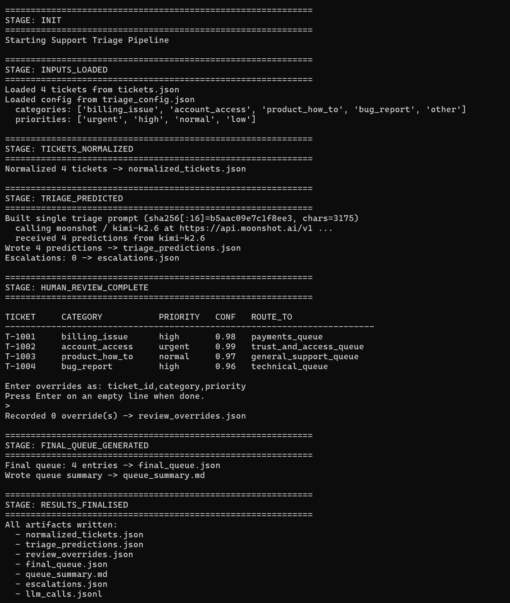

# Support Triage Pipeline

A replayable support-triage pipeline that reads customer support tickets from disk, classifies each ticket into a controlled label set, detects urgency, drafts suggested replies, supports human-review checkpoints for corrections, and produces a final queue summary for agents.



---

## For evaluators / recruiters — run the whole thing in 10 seconds

**You do not need an API key, a `.env` file, or any third-party packages.** The pipeline ships with a deterministic offline fallback that runs purely on the Python standard library and still produces validation-passing outputs.

```bash
# 1. Run the pipeline (no overrides — just skip the prompt with an empty line)
echo. | python triage_pipeline.py     # Windows PowerShell / cmd
echo "" | python triage_pipeline.py   # macOS / Linux / bash

# 2. Validate every artifact against the config
python validate.py
# expect:  ✅ VALIDATION PASSED
```

**To also exercise the human-override path** (optional, demonstrates the override mechanism):

```bash
# Windows PowerShell
"T-1003,bug_report,high`n`n" | python triage_pipeline.py

# macOS / Linux / bash
printf 'T-1003,bug_report,high\n\n' | python triage_pipeline.py

python validate.py
# T-1003 will appear in final_queue.json with was_overridden: true
```

**To run the real LLM path** (optional — uses Moonshot Kimi-K2.6):

```bash
pip install -r requirements.txt
# Put a real KIMI_API_KEY in .env (template lives in .env.example)
python triage_pipeline.py
```

Without a key, the run will silently use the offline heuristic — no warnings, no crashes, validation still passes. The audit log `llm_calls.jsonl` records `"mode":"simulated"` vs `"mode":"real"` so you can verify which path was used.

---

## Report

- [Live demo](https://media.addedability.com/)
- [Interactive HTML report](report/triage.html) — deep architecture diagrams
- [PDF report](report/Support_Triage_Pipeline_Report.pdf)

## Features

- ✅ Deterministic ticket normalization before any LLM call
- ✅ One-shot LLM classification with structured JSON output
- ✅ Interactive human-review checkpoint with config-validated overrides
- ✅ Real Kimi-K2.6 (OpenAI-compatible) integration **with safe offline fallback**
- ✅ Confidence-based escalation rules
- ✅ Stand-alone validator script — five independent checks
- ✅ Full audit trail (LLM call log with mode/model/prompt-hash)
- ✅ Reproducible outputs from a clean checkout
- ✅ Pure-stdlib by default — no required external packages

## Pipeline Stages

The pipeline enforces these seven stages in order:

```
INIT
 -> INPUTS_LOADED
 -> TICKETS_NORMALIZED
 -> TRIAGE_PREDICTED
 -> HUMAN_REVIEW_COMPLETE
 -> FINAL_QUEUE_GENERATED
 -> RESULTS_FINALISED
```

Stages cannot be skipped — they are sequenced from `TriagePipeline.run()` and each one prints a banner with `===` borders.

## Requirements

- **Required**: Python 3.7+ (tested on 3.13 / Windows 11 + PowerShell)
- **Optional**: `openai>=1.0`, `python-dotenv>=1.0` — only needed to call the real LLM. Without them, the pipeline runs the deterministic offline classifier.

## Full Usage Guide

### 1. (Optional) Install dependencies

```bash
pip install -r requirements.txt
```

Skip this if you only want to use the offline heuristic path.

### 2. (Optional) Configure an API key

Copy the template and add your key:

```bash
cp .env.example .env       # macOS / Linux
copy .env.example .env     # Windows
```

Edit `.env`:

```
KIMI_API_KEY=sk-your-key-here
LLM_MODEL=kimi-k2.6
```

`.env` is `.gitignore`d, so your key never ends up on GitHub.

### 3. Run the pipeline

```bash
python triage_pipeline.py
```

You'll see:

1. Stage banners with `===` borders
2. A table of predictions
3. An override prompt:
   ```
   Enter overrides as: ticket_id,category,priority
   Press Enter on an empty line when done.
   >
   ```
4. Final-queue summary printed and written to disk

### 4. Override input format

At the prompt, enter zero or more lines, each in the form:

```
ticket_id,category,priority
```

Example:

```
T-1001,account_access,urgent
T-1003,billing_issue,high
```

End the input with an empty line. Invalid categories/priorities (anything not in `triage_config.json`) are rejected with a warning and skipped.

### 5. Validate the results

```bash
python validate.py
```

Five independent checks:

1. All required files exist and parse as JSON
2. `text_for_model` and `char_count` are deterministic
3. Every prediction respects `allowed_categories` / `allowed_priorities` / `routing_rules` / `reply_style.max_words`
4. Overrides reference real predictions and use valid values
5. `final_queue.json` applies overrides correctly and rederives `final_route_to` from config

Prints `✅ VALIDATION PASSED` on success (exit 0); otherwise lists each failure (exit 1).

## Input Files

### `tickets.json`

Array of customer support tickets:

```json
[
  {
    "ticket_id": "T-1001",
    "customer_id": "C-001",
    "subject": "Charged twice for my deposit",
    "message": "Hi, I made one deposit...",
    "channel": "email",
    "created_at": "2026-05-10T09:15:00Z"
  }
]
```

### `triage_config.json`

Single source of truth for categories, priorities, routing, and reply style:

```json
{
  "allowed_categories": [
    "billing_issue", "account_access", "product_how_to", "bug_report", "other"
  ],
  "allowed_priorities": ["urgent", "high", "normal", "low"],
  "reply_style": { "tone": "clear, polite, concise", "max_words": 80 },
  "routing_rules": {
    "billing_issue":   "payments_queue",
    "account_access":  "trust_and_access_queue",
    "product_how_to":  "general_support_queue",
    "bug_report":      "technical_queue",
    "other":           "manual_review_queue"
  }
}
```

## Output Artifacts

### Required outputs

| File | Description |
|---|---|
| `normalized_tickets.json` | Tickets + `text_for_model` + `char_count` |
| `triage_predictions.json` | LLM predictions (7 keys per ticket) |
| `review_overrides.json` | Human corrections (empty array if none) |
| `final_queue.json` | Post-review queue with `final_route_to` + `was_overridden` |
| `queue_summary.md` | Markdown summary with totals, breakdowns, overridden list |

### Optional outputs

| File | Description |
|---|---|
| `escalations.json` | Tickets where `category == "other"` OR `confidence < 0.60` |
| `llm_calls.jsonl` | Audit log: one record per call with `mode`, `model`, `prompt_hash`, etc. |

## Architecture

### Stage 1 · Normalization (deterministic)

```python
text_for_model = f"Subject: {subject}\nMessage: {message}"
char_count = len(text_for_model)
```

No LLM calls — pure Python.

### Stage 2 · Triage prediction (real LLM with offline fallback)

`_simulate_llm_triage(prompt)` decides which path to take:

- **Real path** — if `openai` is installed AND `KIMI_API_KEY` is set, `_call_real_llm()` posts the prompt to Moonshot's Kimi-K2.6 endpoint (`https://api.moonshot.ai/v1`), strips any markdown fences, parses the JSON, and returns the predictions.
- **Fallback path** — `_heuristic_triage()` uses keyword matching (`"charge"`, `"login"`, `"crash"`, etc.) to pick a category and priority, then fills in a template reply clipped to `reply_style.max_words`.

Both paths feed into `_enforce_config()` which **always rederives `route_to` from `triage_config.json`** — the model's routing suggestion is never trusted.

### Stage 3 · Human review (interactive)

- Prints all predictions in a table
- Accepts overrides line-by-line
- Validates each override against config
- Empty line ends the input
- Writes `review_overrides.json` (still an empty array `[]` if no overrides)

### Stage 4 · Final queue (deterministic)

- Apply overrides on top of predictions
- Recompute `final_route_to = routing_rules[final_category]`
- Mark `was_overridden: true` for any ticket that was changed
- Write `final_queue.json` and `queue_summary.md`

## Validation Checks

✅ **File existence** — all required artifacts present
✅ **JSON validity** — all JSON files parse correctly
✅ **Determinism** — `text_for_model` reconstructable from inputs
✅ **Config compliance** — categories, priorities, routes valid
✅ **Override integrity** — old values match predictions, new values are allowed
✅ **Reply length** — every `suggested_reply` ≤ `reply_style.max_words`
✅ **Final queue consistency** — overrides applied, routes rederived

## Escalation Rules

A ticket is flagged for escalation if **either**:

1. `category == "other"`, OR
2. `confidence < 0.60`

Escalated tickets are written to `escalations.json`.

## Customization

### Replace input files

The pipeline reads from disk — drop in a new `tickets.json` or `triage_config.json` and rerun.

### Use a different LLM provider

The real call is a standard OpenAI-compatible request:

```python
client = OpenAI(api_key=LLM_API_KEY, base_url=LLM_BASE_URL)
resp = client.chat.completions.create(
    model=LLM_MODEL,
    temperature=temperature,   # =1 for kimi-k2.6
    messages=[
        {"role": "system", "content": "You output ONLY valid JSON. ..."},
        {"role": "user",   "content": prompt},
    ],
)
```

Point it at any OpenAI-compatible endpoint by setting `LLM_BASE_URL` and `LLM_MODEL` in `.env`.

### Modify categories

Edit `triage_config.json`:
- Add/remove items in `allowed_categories`
- Map each new category to a queue in `routing_rules`
- Adjust `allowed_priorities` as needed

`validate.py` enforces these against every artifact.

## Project Structure

```
.
├── README.md                       # This file
├── triage_pipeline.py              # Main pipeline (TriagePipeline class)
├── validate.py                     # Five-check validator
├── requirements.txt                # Optional deps: openai, python-dotenv
├── .env.example                    # Template for KIMI_API_KEY + LLM_MODEL
├── .gitignore                      # Excludes .env and regenerable artifacts
├── tickets.json                    # Input: customer tickets
├── triage_config.json              # Input: categories, priorities, routing
├── normalized_tickets.json         # Output: normalized tickets
├── triage_predictions.json         # Output: LLM predictions
├── review_overrides.json           # Output: human corrections
├── final_queue.json                # Output: final routing queue
├── queue_summary.md                # Output: human-readable summary
├── escalations.json                # Output: flagged tickets
├── llm_calls.jsonl                 # Output: LLM audit log
└── report/
    ├── triage.html                 # Interactive architecture diagrams
    └── Support_Triage_Pipeline_Report.pdf
```

## Technical Constraints (all satisfied)

✅ Reads input files from disk — no hardcoded ticket data
✅ Deterministic normalization before any LLM call
✅ Categories and priorities constrained by config
✅ Routing always rederived from `routing_rules`
✅ Human-review overrides flow into the final queue
✅ Reproducible from a clean checkout — no network required
✅ No hardcoded sample outputs
✅ Pure Python standard library by default

## License

Demonstration project for AI-engineering evaluation.
